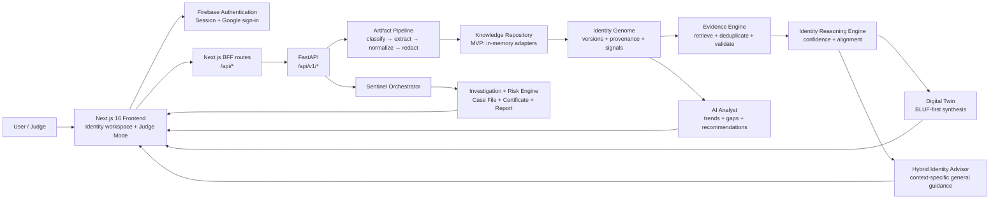
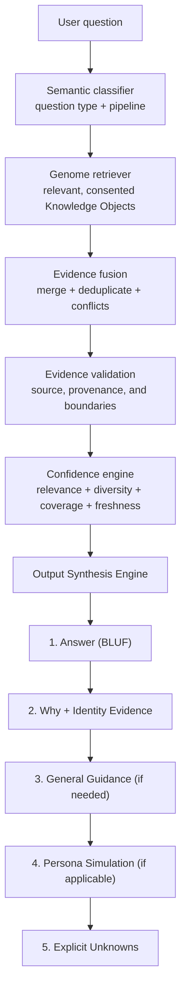

# TrustDNA AI

<p align="center">
  <strong>Evidence-Bound Digital Identity &amp; Personal AI Twin</strong>
</p>

<p align="center">
  <a href="#quick-start"></a>
  <a href="#technology-stack"></a>
  <a href="#technology-stack"></a>
  <a href="#security--privacy"></a>
  <a href="#license"></a>
</p>

> **TrustDNA AI turns consented digital evidence into a living, versioned Identity Genome and an explainable Digital Twin—without inventing memories, personal facts, or certainty.**

AI can now imitate a voice, forge a message, and manufacture a convincing online identity. The harder question is no longer *“Can this content be generated?”* It is *“What evidence supports who created it?”*

TrustDNA AI is the answer: an Identity Trust Platform that establishes a user-controlled evidence baseline, investigates suspicious artifacts, and lets a transparent Digital Twin reason from recorded facts. Every conclusion distinguishes what is **known**, what is **inferred**, what is **general guidance**, and what remains **unknown**.

> [!TIP]
> **Hackathon demo:** open **Judge Demo**, choose a scenario, and watch Sentinel coordinate an evidence-backed investigation into a Case File, verdict, and TrustDNA Certificate.

---

## Table of contents

- [The problem](#the-problem)
- [The solution](#the-solution)
- [Features](#features)
- [Architecture](#architecture)
- [Cognitive pipeline](#cognitive-pipeline)
- [The four-layer response](#the-four-layer-response)
- [Screenshots](#screenshots)
- [Technology stack](#technology-stack)
- [Quick start](#quick-start)
- [Environment variables](#environment-variables)
- [Sample identity data](#sample-identity-data)
- [Example questions](#example-questions)
- [Example response](#example-response)
- [Control center and administration](#control-center-and-administration)
- [Security & privacy](#security--privacy)
- [How GPT-5.6 and Codex were used](#how-gpt-56-and-codex-were-used)
- [Repository structure](#repository-structure)
- [Roadmap](#roadmap)
- [License](#license)
- [Acknowledgements](#acknowledgements)

---

## The problem

Most AI assistants have an uncomfortable failure mode: they sound personal without possessing trustworthy personal context. They either forget the user between interactions or fill gaps with plausible-sounding claims about ambitions, relationships, strengths, history, and preferences.

At the same time, impersonation defenses often start too late. They inspect a suspicious email, résumé, or profile in isolation, after a fake has already reached its target. A score without provenance leaves a recruiter, company, or individual asking the same question: **why should I trust this verdict?**

TrustDNA addresses both problems:

| Failure in conventional AI | TrustDNA response |
| --- | --- |
| Personal facts are guessed or forgotten | Only consented, versioned Identity Evidence can support identity-specific claims. |
| A single opaque score decides authenticity | Evidence, confidence, limitations, and investigation findings remain visible. |
| Advice is presented as personal truth | Identity Alignment, general guidance, and Persona Simulation are explicitly separated. |
| Conflicting facts are silently overwritten | Fact history is retained; revisions can be surfaced in the response trace. |
| “Fake or real” is the whole product | The system opens a Case File, correlates evidence, calculates risk deterministically, and records a defensible verdict. |

---

## The solution

TrustDNA treats identity as an **evidence system**, not as a prompt or personality label.

1. A user adds consented text evidence such as Personal Notes, TXT, or Markdown.
2. The Artifact Pipeline classifies, normalizes, redacts, enriches, and extracts deterministic identity features.
3. Those features become versioned **Knowledge Objects** inside an **Identity Genome**.
4. The Evidence Engine retrieves only relevant objects for a question or investigation.
5. The Digital Twin, Risk Engine, and Analyst produce evidence-backed outputs with explicit confidence boundaries.

### Building blocks

| Building block | What it does |
| --- | --- |
| **Identity Genome** | A living, versioned snapshot of consented facts, feature signals, sources, confidence, and provenance. |
| **Knowledge Objects** | Small, structured records with an immutable ID, type, value, source, evidence, version, timestamp, confidence, and revision history. |
| **Evidence Engine** | Selects, deduplicates, validates, and traces the evidence used by the Twin or an investigation. |
| **Digital Twin** | Answers through deterministic retrieval and reasoning—not fabricated biography or synthetic memory. |
| **Reasoning Pipeline** | Classifies intent, retrieves evidence, applies bounded reasoning, and returns a visible trace. |
| **Confidence Engine** | Communicates relevance, diversity, coverage, sources, freshness, and conflicts instead of hiding uncertainty behind one number. |

> [!IMPORTANT]
> TrustDNA is an MVP for explainable identity intelligence. The current backend uses in-memory repositories, and the supported Genome intake path is consented plain text, TXT, and Markdown. Persistent databases, PDF/DOCX extraction, and richer multimodal connectors are intentionally roadmap items—not implied capabilities.

---

## Features

| Capability | Experience | Evidence boundary |
| --- | --- | --- |
| 🧬 **Identity Genome** | Builds an explainable, versioned identity baseline from consented sources. | Direct facts, provenance, source coverage, and revisions remain inspectable. |
| 🤖 **Identity Twin** | Provides concise, BLUF-first answers about the current Genome. | Never invents memories, relationships, hidden facts, or future certainty. |
| ⚖️ **Evidence-Bound Reasoning** | Routes questions through deterministic retrieval, validation, and confidence scoring. | Personal conclusions require selected Genome evidence. |
| 🧭 **Hybrid Identity Advisor** | Separates identity alignment from carefully labelled general guidance. | General advice is never presented as a personal fact. |
| 🕸️ **Living Knowledge Graph** | Connects structured facts to themes such as identity, education, skills, projects, goals, and interests. | Connections preserve source-linked Knowledge Objects. |
| ✨ **Holographic Genome** | Visualizes the Genome as a live, accessible, motion-aware identity system. | Animation reflects available dimensions and respects reduced-motion preferences. |
| 🗓️ **Evidence Timeline** | Shows Genome versions, source events, and investigation activity. | Timeline entries are tied to recorded events, not inferred biography. |
| 🔎 **Reasoning Trace** | Exposes question type, pipeline, selected evidence, sources, confidence drivers, and unknowns. | Trace is explainable metadata, not hidden chain-of-thought. |
| 📊 **Confidence Scoring** | Communicates evidence relevance, diversity, coverage, freshness, and consistency. | Confidence is bounded by available evidence. |
| 🧩 **Identity Alignment** | Relates a decision or question to recorded priorities and work. | Alignment informs reflection; it does not make a decision for the user. |
| 🎭 **Persona Simulation** | Produces an active, evidence-backed Twin stance for suitable decision questions. | It is clearly marked as a deterministic simulation, never a memory or prediction. |
| 🧠 **AI Analyst** | Surfaces evidence-backed strengths, gaps, trends, recommendations, and an insight timeline. | It reports insufficient evidence rather than calling something a weakness. |
| 🛡️ **Investigation Engine** | Creates explainable cases with specialist evidence analysis and deterministic risk output. | Artifact verdicts require submitted content and the investigation pipeline. |
| 🎬 **Judge Mode** | Offers a no-login, repeatable investigation demo with scripted scenarios. | The UI still calls the backend; it does not bypass the case flow. |
| 🖥️ **TrustDNA Command Center** | Presents system health, Genome evolution, signals, activity, and quick actions. | It is a user control center, not an RBAC administration system. |
| 📜 **Case Files, Certificates & Reports** | Makes a completed investigation shareable through a case view, certificate object, and evidence report. | Certificates are structured from case data before any document rendering. |
| 🧾 **Identity Signals** | Tracks explainable writing, communication, behavior, metadata, timeline, and semantic signals where supported. | No personality is inferred beyond the recorded evidence. |
| 🔁 **Versioned Genome** | Preserves source count, fingerprint, timestamp, confidence, and fact history across changes. | New information creates an evolution trail rather than silently replacing history. |

---

## Architecture



### Design choices that matter

- **Feature-oriented frontend:** each domain owns its components, deterministic services, and UI state under `src/features`.
- **Thin API boundary:** Next.js BFF routes forward to FastAPI without leaking backend contracts into presentation components.
- **Deterministic core:** the current MVP’s knowledge extraction, reasoning, risk aggregation, and evidence fusion are deterministic and auditable.
- **Replaceable adapters:** the backend defines interfaces for embeddings, repositories, connectors, and processors so production infrastructure can be introduced without rewriting the product flow.

---

## Cognitive pipeline



The response order is intentional. A judge or user sees the conclusion immediately, then the evidence needed to challenge it. Lower-priority layers can extend—but never contradict—recorded facts.

---

## The four-layer response

| Layer | Purpose | Guardrail |
| --- | --- | --- |
| **Identity Evidence** | The directly relevant, consented facts and signals from the current Genome. | Highest priority; never inferred. |
| **Identity Alignment** | A deterministic explanation of how the evidence relates to the question. | Cannot override an observed fact. |
| **General Guidance** | Necessary public-domain context for a decision or situation. | Explicitly marked; never passed off as personal knowledge. |
| **Persona Simulation** | An active Twin stance derived from recurring recorded priorities. | Not a prediction, synthetic memory, or private claim. |
| **Explicit Unknowns** | The evidence, constraints, or context the system does not possess. | Always visible when it materially limits the answer. |

### Output Synthesis Engine

The Twin is designed to read like a coherent companion, not a database dump:

- starts with the **bottom line**;
- groups facts into human themes instead of repeating raw dimensions;
- uses domain-specific general guidance only when it adds real value;
- takes a decisive persona stance only when the supporting evidence is strong enough; and
- keeps the full reasoning trace as structured audit metadata rather than exposing hidden chain-of-thought.

---

## Screenshots

The repository intentionally does not ship fabricated product screenshots. Capture the following views from a locally configured run before a hackathon submission, then place the approved images in `docs/screenshots/` and replace the capture targets below.

| Surface | Capture target | What the screenshot should communicate |
| --- | --- | --- |
| **Dashboard** | `docs/screenshots/dashboard.png` | Identity Health, active signals, evolution timeline, and live system state. |
| **Identity Genome** | `docs/screenshots/identity-genome.png` | Hologram, version history, source coverage, and explainable Knowledge Objects. |
| **Identity Twin** | `docs/screenshots/identity-twin.png` | BLUF-first answer, evidence, confidence, persona stance, and unknowns. |
| **AI Analyst** | `docs/screenshots/ai-analyst.png` | Evidence-backed strengths, gaps, trends, and export controls. |
| **Evidence Timeline** | `docs/screenshots/evidence-timeline.png` | Source-linked Genome evolution and case history. |
| **Control Center** | `docs/screenshots/control-center.png` | Module health, Guardian activity, and quick actions. |
| **Living Hologram** | `docs/screenshots/hologram.png` | Identity-dimension nodes, health ring, and accessible motion design. |

<details>
<summary><strong>Suggested hackathon capture sequence</strong></summary>

1. Start on the landing page and state the impersonation problem.
2. Use Judge Mode to run a preconfigured suspicious-email scenario.
3. Pause on the Case File verdict and evidence timeline.
4. Open the Identity Genome to show provenance and versioning.
5. Ask the Twin a decision question to demonstrate the evidence/alignment/guidance boundary.
6. End on the AI Analyst or TrustDNA Certificate.

</details>

---

## Technology stack

| Layer | Technology | Role in TrustDNA |
| --- | --- | --- |
| Frontend | Next.js 16, React 19, TypeScript | App Router product surfaces, BFF routes, typed UI. |
| UI system | Tailwind CSS 4, shadcn/ui, Lucide | Dark glassmorphism design system and accessible primitives. |
| Motion & visualization | Framer Motion, CSS, SVG | Hologram, cognitive, timeline, and reduced-motion-aware interactions. |
| Backend | FastAPI, Python 3.12, Pydantic Settings | Versioned API contracts, artifact processing, and investigation services. |
| Backend tooling | `uv`, Uvicorn, Structlog, Pytest | Fast environments, local server, structured logs, and API test foundation. |
| Authentication | Firebase Authentication | Email/password, Google sign-in, session persistence, and user profile readiness. |
| Client profile store | Firestore when configured | Lightweight account profile and onboarding status. |
| Current data layer | In-memory repository adapters | Fast iteration for the hackathon MVP; not durable storage. |
| Planned production data layer | PostgreSQL + vector store | Durable per-user Genome storage and retrieval after the MVP. |
| AI approach | Deterministic extraction, reasoning, and risk scoring | Explainable evidence decisions; no runtime LLM is required for the core path. |

---

## Quick start

### Prerequisites

- **Node.js 20.9+** and npm
- **Python 3.12**
- **uv** for the FastAPI workspace
- A Firebase project if you want live authentication or Gmail consent

### 1. Clone and configure

```bash
git clone https://github.com/dhairyamittal28106-alt/TrustDNA-AI.git
cd TrustDNA-AI
npm ci
```

Copy the example environment file.

```powershell
Copy-Item .env.example .env.local
```

```bash
# macOS / Linux
cp .env.example .env.local
```

### 2. Start the FastAPI backend

```bash
cd backend
uv sync --python 3.12
uv run uvicorn app.main:app --reload --port 8000
```

The API is available at `http://127.0.0.1:8000`; FastAPI exposes its OpenAPI document at `/openapi.json`.

### 3. Start the Next.js app

Open a second terminal in the repository root:

```bash
npm run dev
```

Open `http://localhost:3000` manually. Use `/demo` for the public Judge Mode flow.

### 4. Run quality checks

```bash
npm run lint
npx tsc --noEmit
npm run build
```

For backend checks:

```bash
cd backend
uv run pytest
uv run ruff check .
```

> [!NOTE]
> The backend runs with in-memory repositories in the current MVP. Restarting it clears active Genome data; this is expected until durable persistence is added.

---

## Environment variables

Start from [`.env.example`](.env.example). Keep `.env.local` out of source control.

| Variable | Required for | Notes |
| --- | --- | --- |
| `TRUSTDNA_API_BASE_URL` | Frontend ↔ FastAPI communication | Default local value: `http://127.0.0.1:8000`. |
| `GMAIL_SYNC_MAX_MESSAGES` | Manual Gmail synchronization | Server-side cap; use a value between 1 and 100. |
| `NEXT_PUBLIC_FIREBASE_API_KEY` | Firebase web app | Public Firebase web configuration identifier, not a service credential. |
| `NEXT_PUBLIC_FIREBASE_AUTH_DOMAIN` | Firebase auth | Must match an authorized Firebase domain. |
| `NEXT_PUBLIC_FIREBASE_PROJECT_ID` | Firebase services | Firebase project identifier. |
| `NEXT_PUBLIC_FIREBASE_STORAGE_BUCKET` | Firebase services | Optional web configuration value. |
| `NEXT_PUBLIC_FIREBASE_MESSAGING_SENDER_ID` | Firebase services | Optional web configuration value. |
| `NEXT_PUBLIC_FIREBASE_APP_ID` | Firebase services | Firebase app identifier. |
| `NEXT_PUBLIC_FIREBASE_MEASUREMENT_ID` | Analytics configuration | Optional. |

### Gmail consent checklist

For Gmail synchronization, enable Google sign-in in Firebase Authentication, add the local/deployed domain to Firebase authorized domains, enable the Gmail API in the matching Google Cloud project, and grant only `gmail.readonly`. If a prior Google grant did not include the scope, revoke TrustDNA in [Google Account permissions](https://myaccount.google.com/permissions) before reconnecting.

Never place service-account keys, Firebase Admin credentials, OAuth refresh tokens, or a user’s raw evidence in any `NEXT_PUBLIC_*` variable.

---

## Sample identity data

Use this consented **Personal Notes** sample during onboarding or in the Identity Genome workspace. It exercises direct deterministic extraction for name, education, ambition, projects, technologies, values, motivations, interests, and fact history.

```text
My name is Aanya Sharma.
I completed my Bachelor of Technology in Computer Science and Engineering at Amity University Punjab.
My long-term dream is to build one of the world's most impactful Artificial Intelligence companies.
I want to become a product-focused AI founder.
I built MediLink AI, CodeVision, FarmSense, SkillBridge and HealthSync.
I know Python, JavaScript, TypeScript, Java, Go, C++, SQL, HTML and CSS.
I regularly use React, Next.js, FastAPI, Node.js, Express.js, PostgreSQL, MongoDB, Firebase, Docker, Kubernetes, AWS, Git and Linux.
I value honesty, curiosity, ownership, discipline, consistency, humility and continuous learning.
My motivations are improving healthcare, building impactful products and helping millions of people.
I enjoy reading biographies, product strategy, cricket and applied artificial intelligence.
My favourite cricketer was MS Dhoni.
Now my favourite cricketer is Rohit Sharma.
```

Expected behavior:

- each listed technology, project, value, and motivation becomes a distinct Knowledge Object;
- both cricketer records remain in history, with the newest record marked current;
- Twin answers use only relevant direct evidence—for example, **“Who am I?”** retrieves the name, while **“Who is my favourite cricketer?”** retrieves the current record plus history when useful;
- a new source produces a new Genome version instead of silently mutating the previous snapshot.

---

## Example questions

<details open>
<summary><strong>25 questions to exercise the Twin</strong></summary>

### Direct Identity Evidence

1. Who am I?
2. What is my name?
3. Where did I study?
4. What is my degree?
5. What is my dream?
6. What projects have I built?
7. Which technologies do I know?
8. Who is my favourite cricketer?
9. What did I value before my latest Genome update?

### Identity Alignment & Persona

10. Should I build a startup?
11. Should I pursue an MBA?
12. What career direction best aligns with my evidence?
13. What motivates me?
14. What kind of people should I work with?
15. What are my weaknesses or likely trade-offs?
16. Should I prioritize another project or deeper technical learning?
17. Which option better fits my stated goals?

### Evolution, Evidence & Confidence

18. How has my identity evolved?
19. What evidence supports your startup recommendation?
20. Which sources contributed to this answer?
21. What does the current Genome not know about me?
22. How confident are you in this answer?
23. Are there conflicting facts in my Genome?

### Boundaries & Investigation

24. Will I definitely become successful?
25. Is this email genuinely written by me?

The final two questions intentionally demonstrate boundaries: future certainty is refused, and artifact verification requires the actual content to enter an investigation.

</details>

---

## Example response

The following is an illustrative Twin response to **“Should I build a startup?”** after importing the sample above.

```text
Continue building a startup through a narrowly scoped, evidence-backed milestone unless another opportunity directly accelerates the same mission.

Why: The selected evidence consistently connects a long-term ambition to build an impactful AI company with a record of shipping product-oriented projects and a stated motivation to improve healthcare.

Identity evidence: The current Genome shows a long-term ambition to build an impactful AI company, a record of building MediLink AI, CodeVision, FarmSense, SkillBridge, and HealthSync, and motivation rooted in improving healthcare, building impactful products, and helping millions of people.

General guidance: For a product decision, validate the next milestone against a specific user problem and real constraints before committing to an irreversible path.

Persona simulation: Given the documented ambition, projects, and values, your Twin would continue building the startup through a narrowly scoped, evidence-backed milestone unless another opportunity directly accelerates the same mission. This is a deterministic stance from documented priorities in the current Genome, not a prediction or an unrecorded personal fact.

Unknowns: Current financial runway, specific market validation, co-founder fit, and time constraints.
```

The supporting reasoning trace remains available as structured metadata: selected sources and evidence count, dimensions used, confidence drivers, ignored dimensions, and explicit missing evidence. TrustDNA does **not** expose hidden chain-of-thought.

---

## Control Center and administration

TrustDNA’s current **Command Center** is a user-facing identity operations view. It is not yet a role-based enterprise administration product, and this distinction is deliberate.

| Area | What the current Control Center can do | Production administration extension |
| --- | --- | --- |
| User accounts | Firebase provides sign-up, sign-in, Google login, password reset, and onboarding state. | Role-based user management, tenant isolation, audit policies, and lifecycle controls. |
| Evidence | Show source coverage, evidence health, timeline activity, and current Identity Genome state. | Retention policies, legal holds, data export/deletion workflows, and organization-level search. |
| Genome versions | Display versioned facts, confidence, source count, history, and update activity. | Durable version storage, rollback policy, approval workflows, and schema migration controls. |
| Identity signals | Surface available writing, communication, behavior, and evidence-quality signals. | Policy thresholds, signal calibration, and organization-level monitoring. |
| Reasoning & Twin health | Display bounded reasoning state, known/unknown boundaries, and system health indicators. | Runtime observability, evaluator dashboards, prompt/model controls where applicable, and alerting. |
| Investigations | Open cases, review evidence, risk output, reports, certificates, and metadata-only history. | Case queues, reviewer assignment, escalation, evidence retention, and external reporting workflows. |
| Configuration | Configure local environment, Firebase, Gmail consent, and backend endpoint deployment settings. | Secure secrets management, SSO, RBAC, audit logs, policy controls, and multi-tenant configuration. |

> [!WARNING]
> Do not describe the current MVP as having enterprise RBAC, durable audit logging, or persistent per-user Genomes. Those are important roadmap commitments, not present-tense claims.

---

## Security & privacy

TrustDNA is built around three product principles: **Evidence over confidence**, **Explainability over black boxes**, and **User control over surveillance**.

- **Consent-first:** only user-consented sources enter the Identity Genome.
- **No hallucinated identity:** personal claims require direct Knowledge Objects or deterministic reasoning over them.
- **Versioned evidence:** Knowledge Objects retain source, evidence, timestamp, version, confidence, and revision history.
- **Explainable outputs:** every Twin answer and investigation can return evidence, confidence drivers, limitations, and unknowns.
- **Deterministic decisions:** the MVP’s core extraction, evidence fusion, risk aggregation, and confidence logic are inspectable and repeatable.
- **Confidence boundaries:** low evidence reduces confidence and may suppress Persona Simulation instead of producing a stronger-sounding answer.
- **Privacy-conscious browser state:** the frontend stores opaque Genome references and returned case metadata in browser session storage; it does not intentionally retain raw source artifacts there.
- **Gmail minimization:** Gmail integration uses read-only consent, supports disconnect/re-authorization, and must not request unnecessary permissions.
- **No unsafe inference:** the Twin does not infer passwords, hidden messages, relationships, medical details, legal circumstances, financial position, or future outcomes.

### Current MVP limitations

- In-memory backend adapters are not durable storage.
- Gmail and Firebase need real environment configuration; the app does not simulate an inbox if the connection is unavailable.
- PDF/DOCX parsing, certificate extraction, speech-to-text, and fully automated multimodal evidence extraction are not yet available.
- TrustDNA is not legal, medical, financial, or forensic-certification advice. Material decisions should use qualified professionals and appropriate verified evidence.

---

## How GPT-5.6 and Codex were used

TrustDNA used AI-assisted engineering as a force multiplier while keeping the product’s runtime identity claims deterministic and evidence-bounded.

| Area | GPT-5.6 contribution | Codex contribution |
| --- | --- | --- |
| Product & architecture | Helped pressure-test the evidence-first product model, component boundaries, and hackathon narrative. | Translated approved decisions into the repository’s feature-oriented structure. |
| Knowledge extraction | Helped formulate coverage cases and deterministic extraction requirements. | Implemented and debugged sentence patterns, normalization, history handling, and integrity safeguards. |
| Reasoning engine | Helped define evidence precedence, confidence boundaries, and the Four-Layer Response Model. | Refactored the Unified Cognitive Orchestrator, routing, response synthesis, and visible trace contracts. |
| Reliability & bug fixing | Helped turn observed product failures into focused diagnostics. | Traced duplicate evidence, corrupted fact values, OAuth scope handoff, and retrieval/ontology defects. |
| UX & visual systems | Helped articulate the forensic-console, hologram, and cognitive-engine experience. | Implemented responsive Next.js surfaces, motion-aware holograms, dashboards, and state handling. |
| Testing & quality | Helped define validation gates and release criteria. | Ran lint, TypeScript validation, production builds, and focused repository checks before commits. |
| Documentation | Helped structure the project story for judges and developers. | Produced and maintained this implementation-aware README and source documentation. |

> [!NOTE]
> GPT-5.6 and Codex were used during design and implementation. They are **not** a runtime source of personal truth in this MVP. Identity-specific outputs are grounded in the current Identity Genome and deterministic reasoning pipeline.

---

## Repository structure

```text
TrustDNA-AI/
├── src/
│   ├── app/                         # Next.js App Router pages and BFF routes
│   │   ├── api/                     # Thin Next.js → FastAPI adapters
│   │   ├── demo/                    # Public Judge Mode entry point
│   │   └── [section]/               # Protected product workspaces
│   ├── components/                  # Shared UI, providers, hologram components
│   ├── features/
│   │   ├── analyst/                 # Evidence-bound AI Analyst
│   │   ├── auth/                    # Firebase auth provider and flows
│   │   ├── dashboard/               # TrustDNA Command Center
│   │   ├── gmail/                   # Read-only Gmail connector and sync UX
│   │   ├── identity-intelligence/   # Genome BFF, source registry, snapshot builder
│   │   ├── identity-knowledge/      # Knowledge Objects, repository, integrity rules
│   │   ├── identity-reasoning/      # Profile aggregation and decision reasoning
│   │   ├── identity-twin/           # Classifier, evidence fusion, Twin synthesis
│   │   ├── investigation/           # Investigation workspace and case history
│   │   └── judge/                   # Deterministic hackathon demo scenarios
│   └── lib/                         # Firebase and shared client helpers
├── backend/
│   ├── app/                         # FastAPI domains, contracts, agents, pipeline
│   ├── tests/                       # Backend contract and API tests
│   ├── pyproject.toml               # Python 3.12 + uv dependencies
│   └── openapi.json                 # API contract snapshot
├── docs/                            # Feature and integration documentation
├── public/                          # Static assets
├── .env.example                     # Safe local configuration template
└── README.md                        # You are here
```

### Further documentation

- [Identity Intelligence](docs/identity-intelligence.md)
- [Living Identity Genome](docs/living-identity-genome.md)
- [Identity Twin](docs/identity-twin.md)
- [Gmail integration](docs/gmail-integration.md)
- [Backend foundation](backend/README.md)

---

## Roadmap

### Version 1 — Hackathon MVP ✅

- Consent-based plain-text Identity Genome creation
- Versioned Knowledge Objects and conflict history
- Evidence-bound Digital Twin and visible reasoning trace
- Identity reasoning, Hybrid Advisor, Persona Simulation, and AI Analyst
- Living Genome visualization and TrustDNA Command Center
- Judge Mode, investigation flow, Case File, certificate, and evidence report surfaces
- Firebase authentication and Gmail integration architecture

### Version 2 — Durable trust layer

- PostgreSQL persistence, Alembic migrations, authenticated user-to-Genome mapping
- Vector retrieval adapters and production embedding providers
- Durable Evidence Reports and certificate verification endpoints
- Expanded source adapters for PDF, DOCX, structured email, and verified transcripts
- Enterprise policies, RBAC, audit logging, and encrypted retention controls

### Future — Trust infrastructure for the AI internet

- Public TrustDNA verification API and signed credentials
- Enterprise impersonation monitoring and alert workflows
- Multi-tenant analyst and investigation operations
- User-controlled portable identity proofs
- Calibrated multimodal forensic evidence with independent evaluation suites

---

## License

Released under the [MIT License](LICENSE).

---

## Acknowledgements

- [OpenAI](https://openai.com/) for advancing trustworthy AI development tools
- **GPT-5.6** for architecture, systems reasoning, and product critique support during development
- **Codex** for implementation, debugging, validation, and documentation acceleration
- [Devpost](https://devpost.com/) and the global hackathon community for the builder ecosystem

---

<p align="center">
  <strong>In the age of AI, trust should not be assumed. It should be provable.</strong><br />
  <sub>Investigate. Verify. Protect.</sub>
</p>
